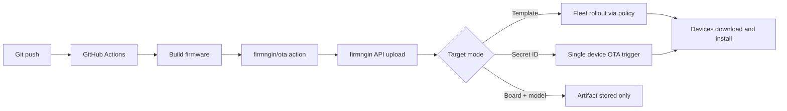

CI/CD lets you build firmware in GitHub and publish it to firmngin automatically. Each successful run can upload a new artifact and, depending on how you configure the workflow, start an OTA rollout to your fleet or a single device.

This path is separate from manual uploads in **Dashboard → Firmware → Artifacts**. CI/CD uses a scoped **API token** so your pipeline can publish firmware without sharing your dashboard login.

## Setup overview

Complete these steps **in order** before your first CI/CD run:

| Step | Action |
| --- | --- |
| **1** | [Generate an API token](#step-1-generate-an-api-token) in the dashboard |
| **2** | [Add the token to GitHub Secrets](#step-2-add-the-token-to-github) |
| **3** | [Add GitHub Secrets and variables](#step-3-add-github-secrets-and-variables) (token, device ID, `keys.h` if needed) |
| **4** | Add the workflow file to your firmware repository |

<Warning>
  You must generate and save the API token **before** configuring GitHub Actions. The token is shown only once at creation time.
</Warning>

## Step 1: Generate an API token

Every CI/CD pipeline needs a workspace API token with the **Firmware OTA** scope. Generate it from the dashboard first — do not skip this step.

### Open Integrations

1. Log in to [firmngin.dev](https://firmngin.dev/login).
2. Select the workspace that owns your devices or device templates.
3. In the sidebar, open **Integrations** (below **Billing**).

The Integrations page lists existing API tokens for the workspace. If you have no tokens yet, the empty state shows a **Generate Token** button.

### Create the token

1. Click **Generate Token** (top right, or from the empty state).
2. On the **Generate API Token** page, fill in:
   - **Token name** — a label you will recognize later (for example `github-ota-production` or `staging-firmware`).
   - **Scopes** — check **Firmware OTA**. At least one scope is required.
3. Click **Generate Token**.

### Copy the token immediately

After generation, firmngin shows the full token **once**. A warning banner reminds you that it will not be shown again.

1. Click **Copy** next to the token value.
2. Paste it into a password manager or directly into GitHub Secrets (see Step 2).
3. Click **OK** to return to the Integrations list.

<Warning>
  If you close the page without copying the token, you cannot recover it. Revoke the token and generate a new one.
</Warning>

### Token format

Generated tokens look like:

```text
fng_pat_<random>@api.firmngin.dev
```

- `fng_pat_` — identifies a workspace API token.
- `@api.firmngin.dev` — API host suffix used by the GitHub Action when no host is embedded in the token.

Copy the **entire string**, including the `@host` suffix if present.

### Manage tokens later

From **Integrations**, you can:

| Action | How |
| --- | --- |
| View active tokens | See name, scopes, prefix, created date, and last used date |
| Revoke a token | Click **Revoke** on the token row — revoked tokens stop working immediately |
| Create another token | Click **Generate Token** — use separate tokens per environment (production vs staging) |

<Tip>
  Scope tokens to **Firmware OTA** only. Do not grant broader permissions than your pipeline needs.
</Tip>

## Step 2: Add the token to GitHub

After copying the token from Step 1, store it as a GitHub **secret** (never as a variable or in workflow YAML).

1. Open your firmware repository on GitHub.
2. Go to **Settings → Secrets and variables → Actions**.
3. Click **New repository secret**.
4. Set:
   - **Name:** `FIRMNGIN_API_TOKEN`
   - **Secret:** paste the full token from Step 1
5. Click **Add secret**.

Reference it in workflows as `${{ secrets.FIRMNGIN_API_TOKEN }}`.

## Step 3: Add GitHub Secrets and variables

Go to **Settings → Secrets and variables → Actions**.

### Secrets (required)

| Name | When to set | Value |
| --- | --- | --- |
| `FIRMNGIN_API_TOKEN` | Always | Full token from [Step 1](#step-1-generate-an-api-token) |
| `FIRMNGIN_DEVICE_SECRET_ID` | Single-device OTA | Device **Secret ID** from the dashboard |
| `FIRMNGIN_KEYS_H` | Arduino sketches using `#include <firmngin.h>` | Full contents of your local `keys.h` file |

<Warning>
  Never commit `keys.h` to git. Add it to `.gitignore` and inject it in CI from the `FIRMNGIN_KEYS_H` secret.
</Warning>

Example workflow step for Arduino projects:

```yaml
- name: Prepare keys.h
  env:
    KEYS_H: ${{ secrets.FIRMNGIN_KEYS_H }}
  run: printf '%s\n' "$KEYS_H" > MySketch/keys.h
```

Place `keys.h` in the **same folder as your `.ino` file**.

### Variables (optional)

Non-secret identifiers can live in **Variables**:

| Name | When to set |
| --- | --- |
| `FIRMNGIN_DEVICE_TEMPLATE_ID` | Fleet OTA via device template |

You can also store `FIRMNGIN_DEVICE_SECRET_ID` as a **secret** (recommended) instead of a variable.

See [Where to find IDs](#where-to-find-ids) below.

## What CI/CD covers

| Step | Handled by |
| --- | --- |
| Checkout source code | Your GitHub workflow |
| Build firmware binary | [PlatformIO](/firmware-ci-cd-platformio) or [Arduino CLI](/firmware-ci-cd-arduino-cli) |
| Upload artifact to firmngin | [`firmngin/ota`](https://github.com/firmngin/ota) GitHub Action |
| Start OTA (optional) | firmngin, based on workflow inputs |

## Deployment modes

Choose **one** target mode per workflow run:

| Mode | Input | What happens after upload |
| --- | --- | --- |
| **Fleet OTA** | `device-template-id` | firmngin matches board/model from the template and starts rollout according to the template **Firmware OTA policy**. Monitor progress under **Firmware → Workflow runs**. |
| **Single device** | `device-secret-id` | firmngin uploads the artifact and immediately triggers OTA on that one device. Best when you have one device without a template. |
| **Artifact only** | `target-board` + `target-model` | firmngin stores the firmware only. Deploy manually from **Firmware → Artifacts** when you are ready. |

<Warning>
  Do not combine `device-template-id` and `device-secret-id` in the same workflow run. They are mutually exclusive.
</Warning>

## Prerequisites

Before adding CI/CD to a repository:

1. A firmngin workspace with at least one registered device or device template.
2. Firmware source that builds with **PlatformIO** (`platformio.ini`) or **Arduino CLI** (sketch folder with matching `.ino` filename).
3. Board and model on your device or template must match the compiled firmware target.
4. For fleet rollouts, a **Firmware OTA policy** attached to the target device template (see [OTA policy](/firmware-ota-policy)).
5. For single-device deploy, the device must have **board name** and **board model** set in the dashboard.

## High-level architecture



## Configure GitHub repository

This section expands Step 2 and Step 3 above.

In your firmware repository, go to **Settings → Secrets and variables → Actions**.

### Secrets

| Name | Value |
| --- | --- |
| `FIRMNGIN_API_TOKEN` | Full token copied in [Step 1](#step-1-generate-an-api-token) |
| `FIRMNGIN_DEVICE_SECRET_ID` | Device Secret ID (single-device OTA) |
| `FIRMNGIN_KEYS_H` | Full `keys.h` content (Arduino + Firmngin library) |

### Variables

| Name | Used when |
| --- | --- |
| `FIRMNGIN_DEVICE_TEMPLATE_ID` | Fleet OTA via device template |

### Where to find IDs

**Device template ID**

1. Open **Dashboard → Device templates**.
2. Open the template you use for fleet devices.
3. Copy the template UUID from the URL or template detail panel.

**Device secret ID**

1. Open **Dashboard → Devices**.
2. Select your device.
3. Copy the **Secret ID** shown on the device page (not the internal database UUID).

## Step 4: Minimal workflow

### Fleet OTA (device template)

```yaml
name: Firmngin OTA

on:
  push:
    branches:
      - main

permissions:
  contents: read

jobs:
  ota:
    runs-on: ubuntu-latest
    steps:
      - uses: actions/checkout@v4

      - uses: firmngin/ota@v1.1.3
        with:
          token: ${{ secrets.FIRMNGIN_API_TOKEN }}
          device-template-id: ${{ vars.FIRMNGIN_DEVICE_TEMPLATE_ID }}
```

### Single device (Arduino + Firmngin library)

```yaml
name: Firmngin OTA

on:
  push:
    branches:
      - main
  workflow_dispatch:

permissions:
  contents: read

jobs:
  ota:
    runs-on: ubuntu-latest
    steps:
      - uses: actions/checkout@v4

      - name: Prepare keys.h
        env:
          KEYS_H: ${{ secrets.FIRMNGIN_KEYS_H }}
        run: printf '%s\n' "$KEYS_H" > my-device/keys.h

      - uses: firmngin/ota@v1.1.3
        with:
          token: ${{ secrets.FIRMNGIN_API_TOKEN }}
          device-secret-id: ${{ secrets.FIRMNGIN_DEVICE_SECRET_ID }}
          platform: arduino
          arduino-fqbn: esp32:esp32:esp32
          arduino-sketch: my-device
          version: ci-${{ github.run_number }}
```

Sketch layout for the example above:

```text
my-device/
  my-device.ino
  keys.h          ← generated in CI, gitignored locally
```

See [GitHub Actions](/firmware-ci-cd-github-actions) for complete workflow examples, all inputs, versioning, and troubleshooting.

## Build tool guides

| Guide | When to use |
| --- | --- |
| [PlatformIO](/firmware-ci-cd-platformio) | Projects with `platformio.ini`, multiple environments, or PlatformIO libraries |
| [Arduino CLI](/firmware-ci-cd-arduino-cli) | Arduino sketch folders with `.ino` files and FQBN-based builds |

## Upload limits and versioning

| Constraint | Value |
| --- | --- |
| Maximum firmware file size | 10 MB |
| Required upload field | `version` (auto-generated by the action if you omit the input) |
| Supported binary | `.bin` produced by PlatformIO or Arduino CLI compile |

The action resolves version in this order:

1. `version` input, if you set it.
2. `git describe --tags --always --dirty`, if git history is available.
3. First 12 characters of the commit SHA.

Use explicit versioning for production releases (for example `1.2.0` or `2026.07.16`).

## After a successful run

| Deployment mode | What to check |
| --- | --- |
| Fleet (template) | **Firmware → Workflow runs** — approval, waves, fleet progress, device logs |
| Single device | **Firmware → Workflow runs** or the device OTA status in **Devices** |
| Artifact only | **Firmware → Artifacts** — deploy manually when ready |

## Security practices

- Never commit API tokens, `keys.h`, or device secret keys to git.
- Scope tokens to **Firmware OTA** only.
- Revoke unused tokens from **Integrations**.
- Use branch protection and required reviews on `main` before OTA runs.
- Prefer **canary** or **staged_expand** policies for production fleets (see [Fleet rollout](/firmware-fleet-rollout)).

## Related

- [GitHub Actions reference](/firmware-ci-cd-github-actions)
- [PlatformIO CI/CD](/firmware-ci-cd-platformio)
- [Arduino CLI CI/CD](/firmware-ci-cd-arduino-cli)
- [Firmware overview](/firmware)
- [OTA policy](/firmware-ota-policy)
- [Workflow control](/firmware-workflow-control)
