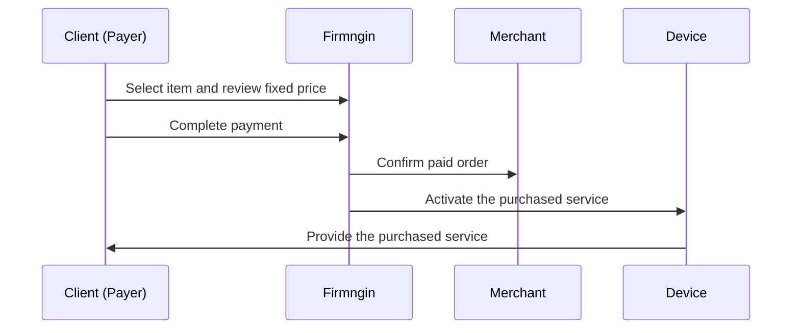
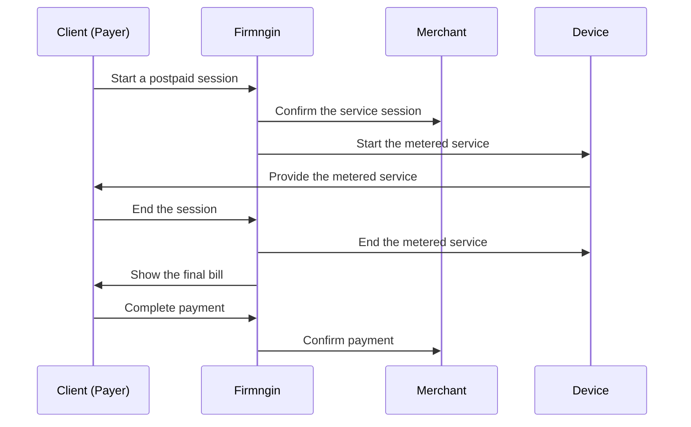

Monetization turns connected devices into paid services. A merchant can publish a public page, sell prepaid services, meter postpaid usage, accept invoice or QR payments, withdraw settled balance through payouts, and review orders, sessions, revenue, and device-level logs.

\[image:monetization dashboard with revenue, orders, sessions, and merchant public page status\]

<Note>
  Monetization is currently available for Indonesia-focused payment flows. Available payment methods depend on the channels enabled for your merchant.
</Note>

## Prepaid and postpaid

The main difference is when the final amount becomes known and when the customer pays.

|  | Prepaid | Postpaid |
| --- | --- | --- |
| When the price is known | Before the service starts | After usage or duration is measured |
| When the customer pays | Before using the service | After the session ends |
| How the amount is calculated | Fixed item price × quantity | Start amount \+ measured usage or duration |
| Quantity | Can allow multiple quantities | One measured session per order |
| Best for | Fixed packages, access fees, and known-price services | Energy, water, rental time, sensor values, and event-based services |
| Configuration | Set a fixed catalog price | Attach an active price rule |

Choose **Prepaid** when every customer should see and pay the final amount before the service begins. Choose **Postpaid** when the final bill depends on what happens during the session.

<CardGroup cols={3}>
  <Card title="Prepaid" icon="credit-card" href="/monetization/prepaid">
    Charge a fixed amount before the customer starts using the service.
  </Card>

  <Card title="Postpaid" icon="gauge" href="/monetization/postpaid">
    Calculate the final amount from usage or duration and collect payment after the session.
  </Card>

  <Card title="Payouts" icon="landmark" href="/monetization/payouts">
    Withdraw available settled merchant balance to a supported payout destination.
  </Card>
</CardGroup>

## Payouts

Customer payments move through their payment and settlement lifecycle before becoming available merchant balance. When balance is settled, use **Payout** to withdraw it to a supported bank account or e-wallet.

The current dashboard requires a minimum payout of IDR 20,000 and prevents withdrawal above the available settled balance. See [Payouts](/monetization/payouts) for the direct payout and payout link flows.

## Prepaid flow

## Postpaid flow

## Plan limits

When your workspace exhausts the message quota on its active plan, Firmngin automatically disables the merchant. While the merchant is disabled, it cannot receive new orders.

Upgrade your plan to restore merchant availability and continue accepting orders.

## Main objects

| Object | Meaning |
| --- | --- |
| Merchant | Workspace-owned monetization profile and public page settings. |
| Item | Sellable product or service attached to one or more devices. |
| Order | Customer purchase intent and payment lifecycle. |
| Session | Time-bound or usage-bound access to a device or service. |
| Payment | Invoice, QR, or provider-specific payment record. |

## Payment state

An order page shows the latest payment state so customers know what to do next.

| State | Meaning |
| --- | --- |
| Pending | The customer still needs to complete payment. |
| Processing | The payment is being confirmed. |
| Paid | Payment is complete and the order can continue. |
| Expired or cancelled | The payment can no longer be completed from that order. |

## Session detail

Session detail shows the start time, end time, device, item, payment method, who ended the session, and whether the service is still active.

## Public pages

Public pages should:

- Show only device names allowed by workspace settings.
- Show whether a device is currently available.
- Keep the customer's active order visible while the service is running.
- Present clear payment, verification, and session actions.