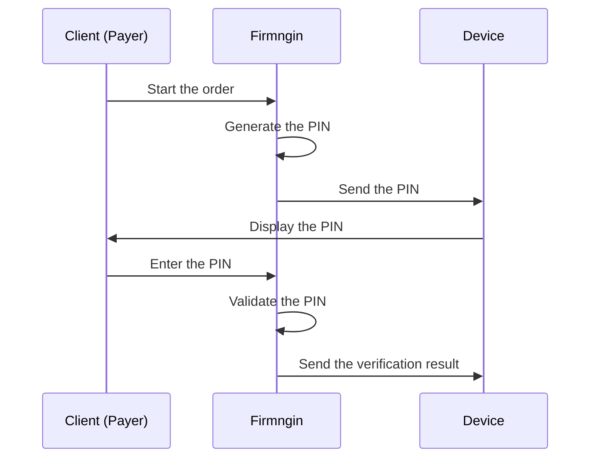
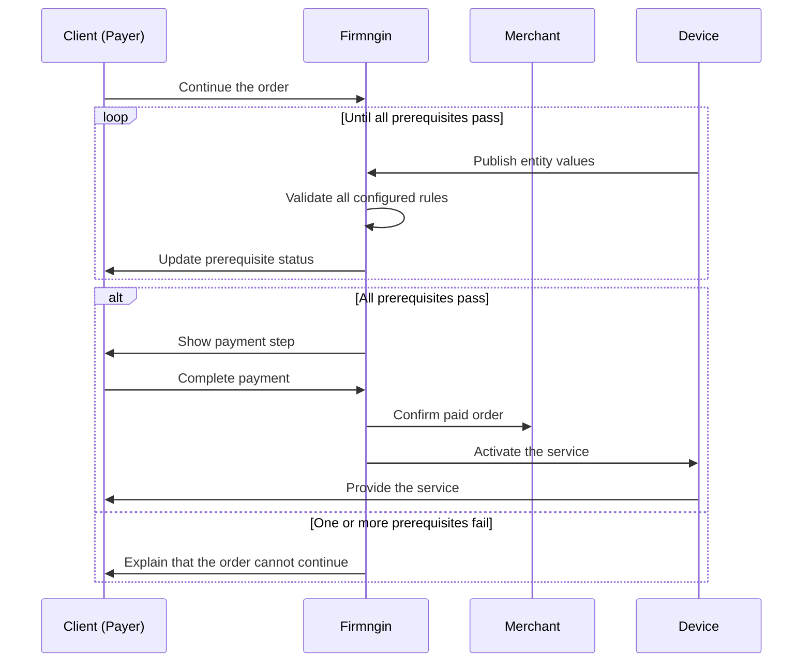

Merchant setup connects a merchant profile to the devices that can be sold, rented, or activated from a public page. Use this page to understand the setup order before opening the merchant page to customers.

\[image:merchant detail page showing sidebar with Linked Devices, Catalog, Orders, Transactions, and Settings\]

## Setup sequence

Set up a merchant in this order:

1. Start in test/debug mode.
2. Link devices to the merchant.
3. Configure Map Entity for customer-facing device display.
4. Configure Flow for verification and stop behavior.
5. Prepare catalog items and public page content.
6. Test the public checkout experience.
7. Review payment channels.
8. Submit live merchant verification before accepting real customer payments.

## Start in test/debug mode

Merchants can be prepared in test/debug mode before going live. Test mode is useful for setup and validation:

- Link devices to the merchant.
- Prepare catalog items and public page content.
- Configure device entity display.
- Test verification and stop flow behavior.
- Review the public checkout experience without treating it as a real customer payment flow.

<Note>
  Keep the merchant in test/debug mode while configuring devices and flow rules.
</Note>

## Linked devices

A linked device is a device assigned to a merchant. After a device is linked, it can appear in the merchant's monetization setup and can be used by catalog items, public pages, sessions, and device-level reports.

In the dashboard, open a merchant and go to **Linked Devices** to manage the device list.

You can:

- Link a device that is not yet linked to the merchant.
- Search and filter available devices before linking.
- Open a linked device setup drawer.
- Unlink a device when it should no longer be used by that merchant.
- See when the device was linked.
- Open the device's public store page when a public page is available.

\[image:merchant linked devices table with Link Devices dialog and linked device action menu\]

## Linked device setup order

After a device is linked, configure the device-specific monetization setup in this order:

1. Open the linked device setup drawer.
2. Review the device overview and current service status.
3. Configure **Map Entity** for customer-facing display.
4. Configure **Flow** for verification and stop mode.
5. Test the public page and checkout flow before going live.

## Map Entity

**Map Entity** controls how device entities appear in the merchant experience. This is where you decide which device values or controls should be visible to customers and how they should be labeled.

Use Map Entity to:

- Show or hide each entity from the customer-facing page.
- Rename an entity with a merchant-friendly display name.
- Reorder visible entities.
- Map raw values into clearer labels when needed.
- Keep internal or maintenance-only values hidden from customers.

Example: a firmware entity may use a short internal key, while the merchant page can show a simpler label such as "Door Lock", "Temperature", or "Remaining Time".

<Warning>
  Do not expose internal-only entities on public pages. Only show values that help customers understand or use the service.
</Warning>

\[image:linked device setup drawer showing Map Entity with show/hide toggles, map name fields, and value mapping\]

## Flow

**Flow** controls what must happen before, during, or after a paid device session. In the current setup, Flow covers verification and stop mode.

### Verification

Verification helps make sure the customer or device is ready before the order continues.

Available verification options include:

| Option | What it does |
| --- | --- |
| PIN Verification | The device shows a PIN, and the customer enters it on the order page to prove they are near the device. |
| Order Prerequisites | The system checks selected device entity values before the order continues. |

Order prerequisites are checked before payment. The customer can only continue to payment after all configured device conditions are met.

\[image:linked device Flow tab showing PIN Verification and Order Prerequisites\]

### PIN verification flow

Use PIN verification when the customer must prove that they are physically near the merchant's device before the service continues.

If the PIN is incorrect or expires, the client must use the current PIN shown by the device before continuing.

### Prerequisite before payment flow

Choose **Before Payment** when the client should only pay after Firmngin validates that the linked device's entity values satisfy every configured prerequisite.

This option reduces the chance that a customer pays while the service is unavailable.

### Stop mode

Stop mode controls who or what is allowed to end an active device session.

| Stop source | Meaning |
| --- | --- |
| Manual End | The customer can end their active session from the public order page. This is always available. |
| Device Local End | The device firmware can end the active session from device-side logic when this option is enabled. |
| Dashboard force end | A dashboard user can force-end an active session when changing a device back to idle or maintenance. |

Enable **Device Local End** only when the firmware is designed to end sessions from the device itself. If the firmware does not support that behavior, leave it off and rely on manual end or dashboard controls.

## Before going live

After linked devices, Map Entity, Flow, catalog items, and public page content are ready, review payment channels and submit live merchant verification.

Live merchants are approved merchants that can accept real customer payments. A merchant should only be used for real transactions after live verification is approved.

<Warning>
  Do not use a test/debug merchant to collect real customer payments.
</Warning>

## Quick checklist

Before using a linked device with real customers:

- The merchant has been configured and tested in test/debug mode.
- The correct devices are linked to the merchant.
- Customer-facing entities are reviewed in Map Entity.
- Internal-only entities are hidden.
- Verification rules are tested.
- Stop mode matches the expected physical device behavior.
- The public page and checkout flow are reviewed end to end.
- The merchant is approved for live payments if real transactions are needed.
