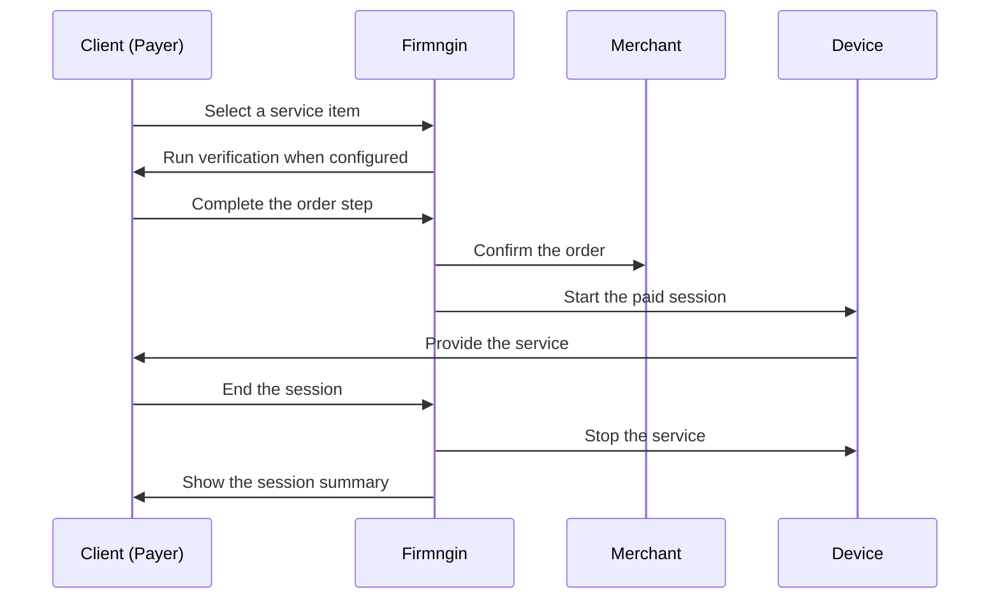

Service mode sells time or usage on a device. After the order is confirmed, a session starts on the device and stays open until it ends. Service is the default business mode for a linked device.

Common service use cases:

- Laundry washing or drying cycles.
- Massage chairs and similar timed equipment.
- EV charging.
- Locker storage.
- Rental equipment billed by time or usage.

## How a service order works

<Steps>
  <Step title="Customer picks one item">
    The customer opens the device's public page and selects a single service item.
  </Step>
  <Step title="Verification runs when configured">
    PIN verification and order prerequisites run according to the device's **Flow** settings.
  </Step>
  <Step title="Payment happens">
    Prepaid items are paid before the session starts. Postpaid items collect payment after the session ends.
  </Step>
  <Step title="Session starts">
    The device activates the paid service and the order page shows the active session.
  </Step>
  <Step title="Session ends">
    The session ends manually, from the device, or from the dashboard, depending on your stop mode settings.
  </Step>
</Steps>

## Payment types

Service mode supports both payment types:

- **Prepaid** for fixed-price packages and known-duration services.
- **Postpaid** for bills calculated from measured usage or duration.

See [Prepaid](/monetization/prepaid) and [Postpaid](/monetization/postpaid) for item setup.

## One item per order

A service order covers one catalog item, because a session belongs to one device activation. Customers cannot combine several different service items in a single checkout.

If an item allows multiple quantities, the quantity still applies to that one item.

<Note>
  Multi-item carts are only available in [Vending Mode](/monetization/vending-mode).
</Note>

## Sessions

Each paid service order creates a session. The **Sessions** view in the linked device drawer shows session activity for that device.

Session detail includes the start time, end time, device, item, payment method, who ended the session, and whether the service is still running.

After a session ends, the payer receives a session summary by email.

## Ending a session

Stop mode decides who can end an active session:

| Stop source | Meaning |
| --- | --- |
| Manual End | The customer ends the session from the public order page. Always available. |
| Device Local End | The device ends the session from its own logic when this option is enabled. |
| Dashboard force end | A dashboard user force-ends the session, for example when moving the device to maintenance. |

Configure stop mode in the device's **Flow** settings. See [Merchant Setup](/monetization/merchant-setup) for the full flow reference.

## Service flow

## Checklist

- The device's business mode is set to **Service**.
- Catalog items use the correct prepaid or postpaid setup.
- Map Entity shows only customer-friendly values.
- Verification and prerequisites are tested.
- Stop mode matches how the physical device behaves.
- A full test order has been completed before going live.