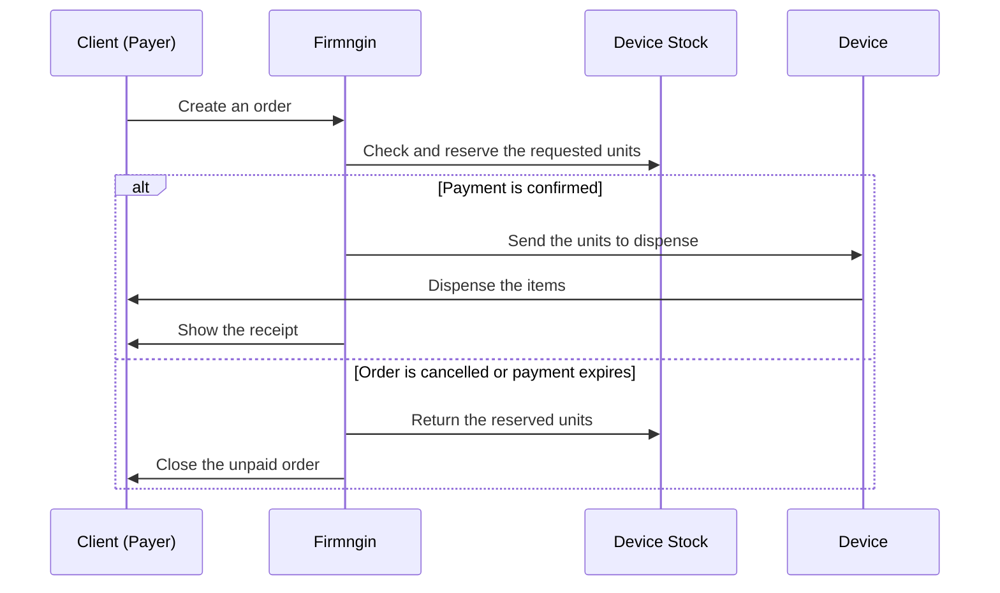
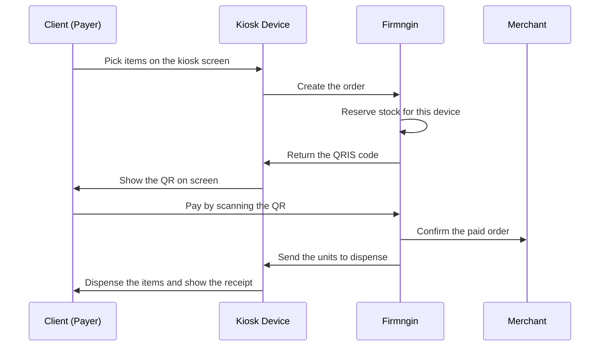
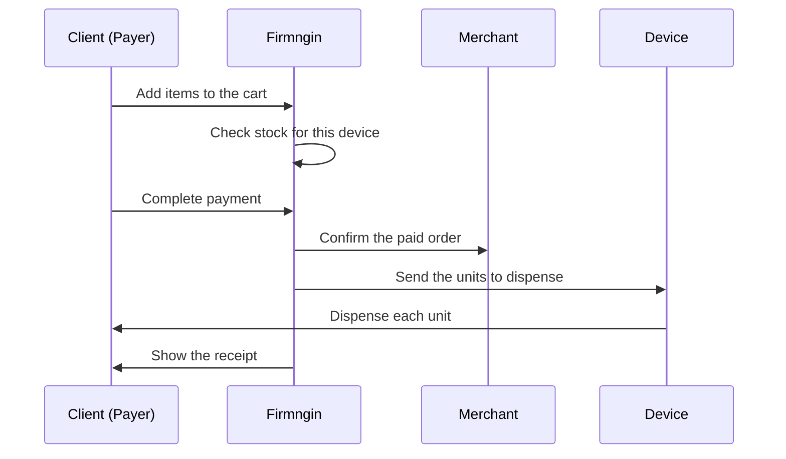

Vending mode sells physical items. The customer builds a cart, pays, and the device dispenses the paid units. There is no open session afterwards, so the order completes at dispense.

Common vending use cases:

- Snack machines.
- Drink dispensers.
- Capsule or token vendors.
- Any device that releases a fixed number of units per order.

## How a vending order works

<Steps>
  <Step title="Customer builds a cart">
    The customer opens the device's public page and adds one or more items, each with its own quantity.
  </Step>
  <Step title="Stock is checked">
    Items that are sold out on that device cannot be added to the order.
  </Step>
  <Step title="Customer pays">
    Vending orders are always paid before dispense. The stock for the ordered units is reserved when the order is created.
  </Step>
  <Step title="Device dispenses">
    After payment is confirmed, the device receives the dispense instruction with one entry per unit and releases each item.
  </Step>
  <Step title="Order completes">
    The customer sees the receipt. No session stays open.
  </Step>
</Steps>

## Prepaid items only

Vending devices sell prepaid items. Postpaid and usage-based items cannot be purchased from a vending device, because the amount must be final before the device releases anything.

If a customer tries to check out a postpaid item on a vending device, the order is rejected as unavailable.

<Note>
  Set **Payment Type** to **Prepaid** on every catalog item you plan to sell from a vending device.
</Note>

## Multi-item cart

Vending is the only mode that supports a cart with several different items in one checkout. The public page shows a cart icon with the current item count, and each line can have its own quantity.

The dispense instruction repeats one entry per unit, so a quantity of three produces three dispense entries.

## Vending Stock

When a device uses vending mode, the linked device drawer adds a **Vending Stock** menu. Stock is tracked per device, so devices that share the same catalog keep separate inventory.

1. Open **Monetization**, select your merchant, then go to **Linked Devices**.
2. Open the device setup drawer.
3. Go to **Vending Stock**.
4. Set the stock value for each catalog item.

| Stock value | Meaning |
| --- | --- |
| Empty | Unlimited supply on this device |
| `0` | Sold out on this device |
| Any number | Remaining units available on this device |

\[image:Vending Stock view listing catalog items with per-device stock values\]

### How reservations work

- Stock is reserved when the order is created, so two customers cannot buy the last unit at the same time.
- Reserved stock returns to the device when the order is cancelled or the payment expires.
- Items with unlimited stock never reserve or restore anything.
- A paid order never returns stock, because the units were already dispensed.

<Warning>
  Refill the physical machine and update **Vending Stock** together. A stock number that is higher than the real inventory lets customers pay for units the device cannot dispense.
</Warning>

## Kiosk mode

Kiosk mode moves checkout onto the device itself. Instead of continuing on their own phone, the customer picks items and pays on the kiosk screen.

Kiosk mode is an option on top of vending mode, not a separate business mode.

### Requirements

- The device business mode is **Vending**.
- The device is a Python device, such as a Raspberry Pi or another supported Linux board.
- QRIS is available for your merchant, because kiosk checkout uses QRIS only.

The kiosk switch stays disabled on devices that are not supported, and the dashboard shows that it is only available for Python devices.

### Enable kiosk mode

1. Open the linked device setup drawer.
2. In the **Business Mode** card, select **Vending**.
3. Turn on **Kiosk mode**.

Switching the device back to **Service** turns kiosk mode off automatically.

\[image:Business Mode card with Vending selected and the Kiosk mode switch enabled\]

### What the customer sees

Kiosk mode uses a simplified, screen-friendly version of the public page:

| Behavior | Kiosk mode | Standard vending |
| --- | --- | --- |
| Where checkout happens | On the device screen | On the customer's own device |
| Payment method | QRIS only | Any enabled payment channel |
| How the customer pays | Scans the QR shown on the kiosk screen | Continues on the payment page |
| Customer name and email | Not asked | Collected at checkout |
| Catalog and My Orders navigation | Hidden | Shown |
| Theme and language selectors | Hidden | Shown |

After the QR is scanned and payment is confirmed, the kiosk screen shows the receipt and the device dispenses the items.

### Kiosk checkout flow

If the customer walks away, the order can be cancelled or left to expire. Either outcome returns the reserved stock to the device.

<Note>
  Keep kiosk mode off when customers should pay from their own phone with the full range of payment channels.
</Note>

## Vending flow

## Checklist

- The device's business mode is set to **Vending**.
- Every item sold on the device uses prepaid payment type.
- **Vending Stock** matches the real inventory in the machine.
- Sold-out items are set to `0` instead of being left unlimited.
- Dispense behavior has been tested with a multi-unit order.
- Kiosk mode is only enabled on supported devices, and the on-screen QR checkout has been tested.